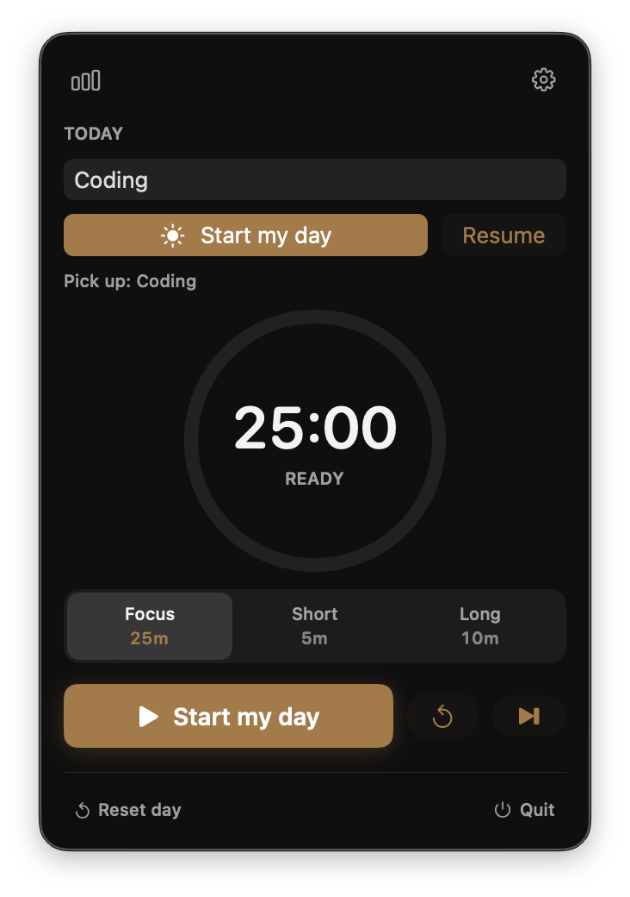
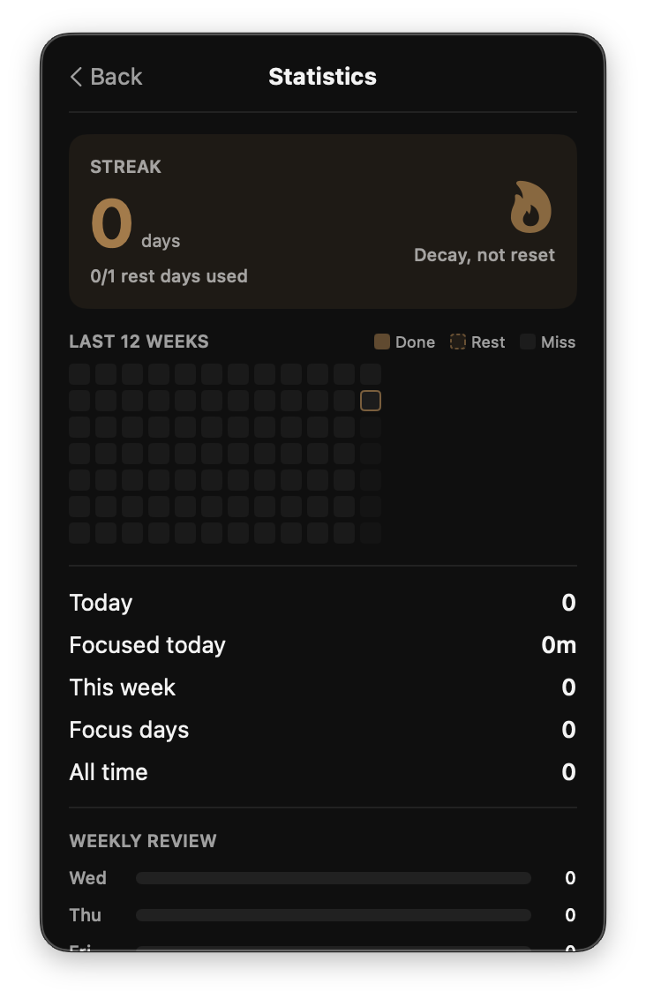
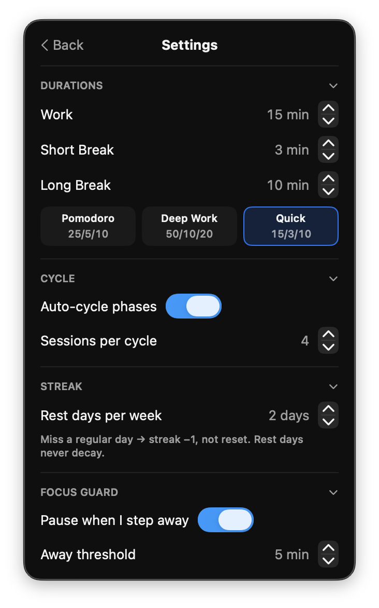

# Breaks

A small Pomodoro app that lives in your Mac menu bar.

I built Breaks because every other timer either nagged me too much, hid in a Dock icon I never wanted, or treated breaks as an afterthought. This one is the opposite. It's quiet, it remembers what you were focused on, and it actually cares whether the break was any good.

<p align="center">
  
  
  
</p>


## What it does

- Lives in the menu bar. Click the icon, get a popover. No Dock clutter, no extra window.
- Pomodoro the way you want it. Tweak work / short break / long break lengths, sessions per cycle, sounds, auto-start behavior.
- Global hotkeys for start/pause, skip, and reset cycle. Bind whatever keys you like. Works even when the app isn't focused, because it uses Carbon's `RegisterEventHotKey` instead of the flaky `NSEvent` route.
- A focus journal that's actually useful. Pick a focus for the day, label each block, mark it good, messy, or skipped. It's quick, takes one tap during the break, and adds up over the week.
- Streaks with grace. Miss a day and you get a small per-week pause budget before the streak decays. Life happens.
- Idle detection. If you walked away mid-session, Breaks notices and asks whether the time should still count.
- Survives sleep. Close the lid, come back, the timer is still where it should be. It's driven by an `endDate` plus `NSWorkspace` sleep/wake notifications, so it doesn't drift.
- Sandboxed and small. No analytics, no account, nothing leaves your machine. State lives in `UserDefaults`.

## Install

Grab the latest build from [Releases](https://github.com/GjinPrelvukaj/Breaks/releases/latest):

1. Download `Breaks-vX.Y-macOS.zip`
2. Unzip and drag `Breaks.app` into `/Applications`
3. First launch: right-click the app, then **Open**. The build is ad-hoc signed, not notarized, so Gatekeeper needs the manual override the first time.

Apple Silicon, macOS 13.0 or later.

## Build from source

```sh
git clone git@gjinprelvukaj.github.com:GjinPrelvukaj/Breaks.git
cd Breaks
open Breaks.xcodeproj
```

Then Cmd+R in Xcode. Or from the CLI:

```sh
xcodebuild -project Breaks.xcodeproj -scheme Breaks -configuration Debug build
```

Requires a recent Xcode.

## Reset state

Everything is in `UserDefaults` under the bundle ID. To wipe settings, history, and the journal in one go:

```sh
defaults delete com.gjinprelvukaj.Breaks
```

## How it's built

SwiftUI all the way down. The codebase is split into four small folders:

```
Breaks/
├── BreaksApp.swift              entry point + menu bar label
├── SharedStorage.swift          UserDefaults keys, widget snapshot
├── Models/
│   ├── BreakTimer.swift         the controller. modes, ticks, idle, sleep
│   ├── TimerSettings.swift      every user-tunable knob
│   ├── SessionHistory.swift     daily counts and streak math (with pause budget)
│   └── FocusJournal.swift       today's focus, per-block labels, weekly rollups
├── Views/
│   ├── TimerPopover.swift       routes between onboarding, stats, settings, timer
│   ├── TimerContentView.swift   main page. check-in, dashboard, panels
│   ├── TimerRing.swift          the circular progress ring
│   ├── OnboardingView.swift     three-step onboarding
│   ├── StatsView.swift          streak hero, heatmap, weekly review
│   ├── SettingsPanel.swift      collapsible settings sections
│   └── ReusableComponents.swift segmented pickers, hotkey rows, etc
├── Style/                       button styles, hex colors, glass cards
└── System/
    ├── Hotkeys.swift            Carbon global hotkeys
    ├── LoginItemController.swift SMAppService wrapper
    └── NotificationPermissions.swift
```

A few things worth flagging if you go editing:

- **Tick decoupling.** `BreakTimer.remaining` only updates at action boundaries (start, pause, reset, fire). Per-second updates flow through a separate `TickClock` `ObservableObject`. That keeps the popover view tree from re-rendering every single second. If you add UI that needs the live countdown, observe `TickClock`, not `BreakTimer`.
- **Persistence per-property.** Each `@Published` setting writes itself in its own `didSet`. There's no central save call. New settings should follow the same pattern.
- **Pruning at write time.** `SessionHistory` is capped at 120 days and `FocusJournal` logs at 30, pruned when you write rather than when you read. That keeps cold-start reads cheap.
- **Streak math.** `SessionHistory.streakSnapshot(pauseDayBudget:)` walks day-by-day from the earliest record forward and decays by 1 per missed day, except the first N missed days each ISO week are absorbed by the budget. That's the only non-trivial bit of logic in the app.
- **Explicit imports.** The project sets `SWIFT_UPCOMING_FEATURE_MEMBER_IMPORT_VISIBILITY = YES`, so every file has to import what it actually uses (`import Combine` for `@Published`, etc). Don't rely on transitive imports through `SwiftUI`.

## Permissions

Breaks asks for two things:

- Notifications, so you actually know when a session ends. Granted from the onboarding screen.
- Launch at login, optional, via `SMAppService`. Toggle it in settings.

That's it. No accessibility, no automation, no calendar, no network.

## Roadmap

What's planned, what's shipped, what might happen one day: [Breaks Roadmap](https://github.com/users/GjinPrelvukaj/projects/1).

If something on there matters to you, react on the issue with a 👍, that's how I prioritize.

## Status

I use it daily. It probably has rough edges if your workflow is very different from mine. PRs and issues are welcome, but fair warning, this is a personal app first.

## License

MIT. Do whatever you want with it.
